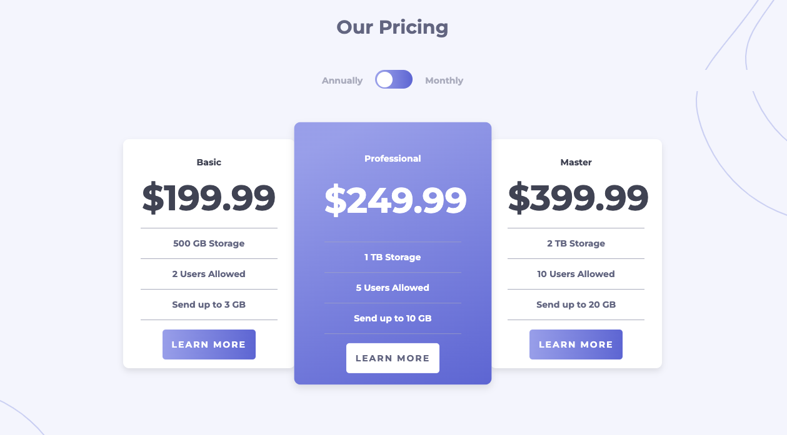

# Frontend Mentor - Pricing component with toggle solution

This is a solution to the [Pricing component with toggle challenge on Frontend Mentor](https://www.frontendmentor.io/challenges/pricing-component-with-toggle-8vPwRMIC). Frontend Mentor challenges help you improve your coding skills by building realistic projects.

## Table of contents

- [Frontend Mentor - Pricing component with toggle solution](#frontend-mentor---pricing-component-with-toggle-solution)
  - [Table of contents](#table-of-contents)
  - [Overview](#overview)
    - [The challenge](#the-challenge)
    - [Screenshot](#screenshot)
    - [Links](#links)
  - [My process](#my-process)
    - [Built with](#built-with)
    - [What I learned](#what-i-learned)
    - [Continued development](#continued-development)
  - [Author](#author)
  - [Acknowledgments](#acknowledgments)

**Note: Delete this note and update the table of contents based on what sections you keep.**

## Overview

### The challenge

Users should be able to:

- View the optimal layout for the component depending on their device's screen size
- Control the toggle with both their mouse/trackpad and their keyboard
- **Bonus**: Complete the challenge with just HTML and CSS

### Screenshot



### Links

- Solution URL: [Github](https://github.com/drobb2020/pricing-component)
- Live Site URL: [Netlify](https://bespoke-bublanina-0c94f6.netlify.app/)

## My process

### Built with

- Semantic HTML5 markup
- CSS custom properties
- Flexbox
- JavaScript

### What I learned

How to style a checkbox into a slider, see the code sample below.

```html
<div class="toggle-container">
        <span>Annually</span>
        <span>
          <input type="checkbox" name="toggle" id="toggle" unchecked />
          <label for="toggle">
            <div class="ball"></div>
          </label>
        </span>
        <span>Monthly</span>
      </div>
```

```css
.toggle-container label .ball {
  background-color: white;
  border-radius: 50%;
  height: 25px;
  left: 2.5px;
  position: absolute;
  top: 2.5px;
  transition: transform 0.4s ease;
  width: 25px;
}

.toggle-container input:checked + label .ball {
  transform: translateX(30px);
}
```

```js
toggle.addEventListener('change', (e) => {
    flexy.classList.toggle('show-monthly')
})
```

### Continued development

I'm going to continue to do Frontend Mentor challenges when I have time. This is my sixth challenge and I've enjoyed all of them.

## Author

- Website - [David Robb](https://davidrobb2021.tech)
- Frontend Mentor - [@drobb2020](https://www.frontendmentor.io/profile/drobb2020)
- Twitter - [@DavidRobb2](https://www.twitter.com/DavidRobb2)

**Note: Delete this note and add/remove/edit lines above based on what links you'd like to share.**

## Acknowledgments

I want to thank all the mentors I have followed on YouTube that got me to this point where I can complete a challenge on my own.
